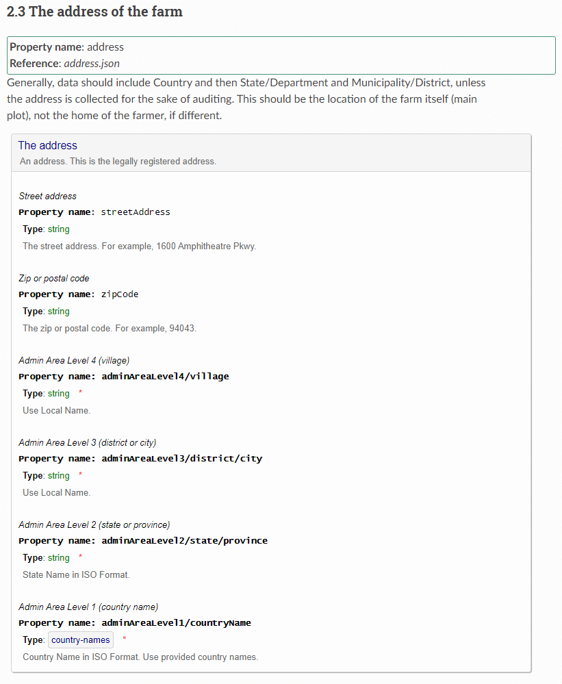

*******************************
How to update the documentation
*******************************

============================
Guidelines
============================

The documentation of the schema is in the schema itself.
Meaning it is not necessary to maintain separate documentation.

For the `ReadTheDocs <https://docs.readthedocs.io/en/stable/tutorial/>`_ website, the documentation from the schema needs to be extracted and saved in a .rst file.

For the purpose of the website, the schema is split into several files. The main file or starting point is `farmData.schema.json <https://raw.githubusercontent.com/globalcoffeeplatform/Delta-DataWarehouse-Documentation/main/schema/farmData.schema.json>`_.

For example, the definition of the farm address is in a separate file called `address.json <https://raw.githubusercontent.com/globalcoffeeplatform/Delta-DataWarehouse-Documentation/main/schema/address.json>`_.

This splitting results in the following layout on the website:

As you can see, the address is inside a box showing its properties. This part is generated using `Docson <https://github.com/lbovet/docson>`_.

To generate the mentioned .rst file (`explanation.rst <https://raw.githubusercontent.com/globalcoffeeplatform/Delta-DataWarehouse-Documentation/main/docs/source/explanation.rst>`_) a small `C# application <https://github.com/globalcoffeeplatform/Delta-DataWarehouse-Documentation/tree/main/generator>`_ (.NET6) is made.

When this application is executed it will parse the schema files and generates the ``explanation.rst``.

So this needs to be done after every change in the schema or else the website will not show those changes.

After committing the updated files, ReadTheDocs will generate the necessary HTML files to make up the website.

==========================
Rst generator application
==========================

Requirements
------------
To be able to run this application you need at least `VS2022 Community Edition <https://visualstudio.microsoft.com/vs/community/>`_.

It is also possible to test the website locally. Then you also need to install Sphinx and Python. 
Read the `Installing Sphinx <https://www.sphinx-doc.org/en/master/usage/installation.html>`_ to get started.

Run generator
-------------
First clone the whole repo from https://github.com/globalcoffeeplatform/Delta-DataWarehouse-Documentation.

Next, go to the generator folder and open ``Generator.sln`` in VS2022.

In VS2022 open ``GenerateRst.cs`` and look at the top of the file for the constants ``WorkingPath`` and ``RunSphinx``.

``WorkingPath`` should hold the folder location where you checked out the source code. The ``schema`` folder should be its subfolder.

If you have Sphinx properly installed you can set ``RunSphinx`` to true. Then it will generate the HTML files that make up the website as ReadTheDocs would.

It is highly recommended to test your website before pushing it to the repo. Sphinx will not only generate the HTML but will also check your .rst-files and report any errors you might have.    

When you've generated the HTML you can view it in your browser by opening ``file:///D:/dev/GlobalCoffeePlatform/DeltaDataWarehouse/git/docs/build/html/index.html`` 
where `D:/dev/GlobalCoffeePlatform/DeltaDataWarehouse/git` is your ``WorkingPath`` as set in ``GenerateRst.cs``. 

Push to Github
--------------
After generating the updated ``explanation.rst`` and checking the HTML files, the changes can be committed and pushed to Github.

The push triggers ReadTheDocs to do a pull and generate the updated HTML and deploy the updated website.

When you have enough rights (you need to be a ``maintainer`` of the project) you can see the build results at https://readthedocs.org/projects/delta-datawarehouse/builds/
and check the updated website at https://delta-datawarehouse.readthedocs.io/en/latest/index.html.

==========================
Static pages
==========================

There are several static pages which can be directly updated:

* about.rst
* governance.rst
* how-to-update.rst (this page)
* index.rst
* use-cases.rst

After updating these files you can push them to Github and ReadTheDocs will run a new build.

The syntax of a .rst file is a bit different than other markup languages. A good cheat sheet is available at https://thomas-cokelaer.info/tutorials/sphinx/rest_syntax.html

